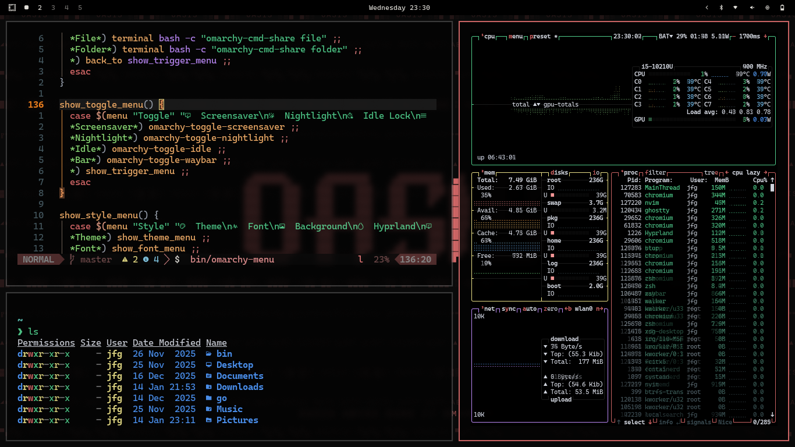
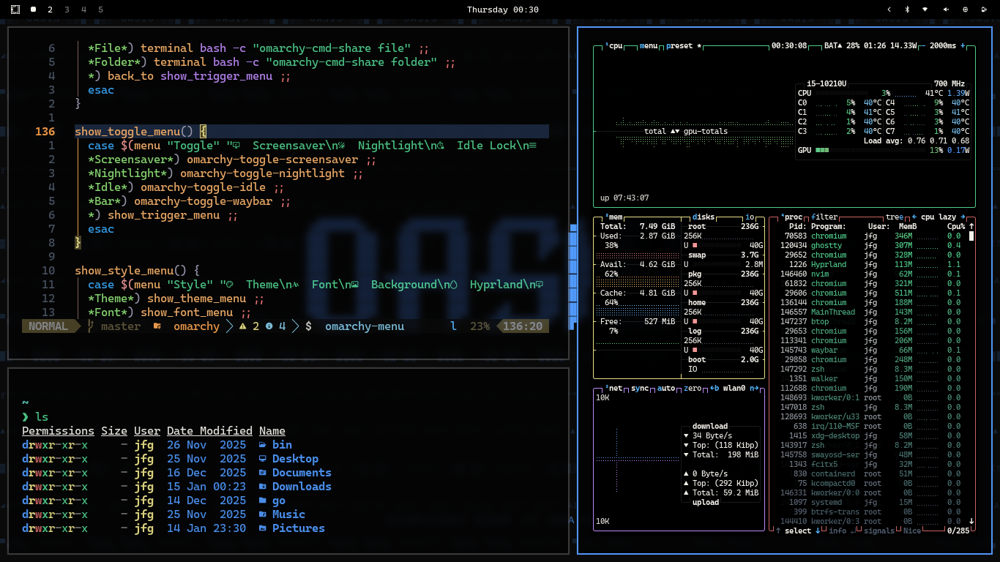
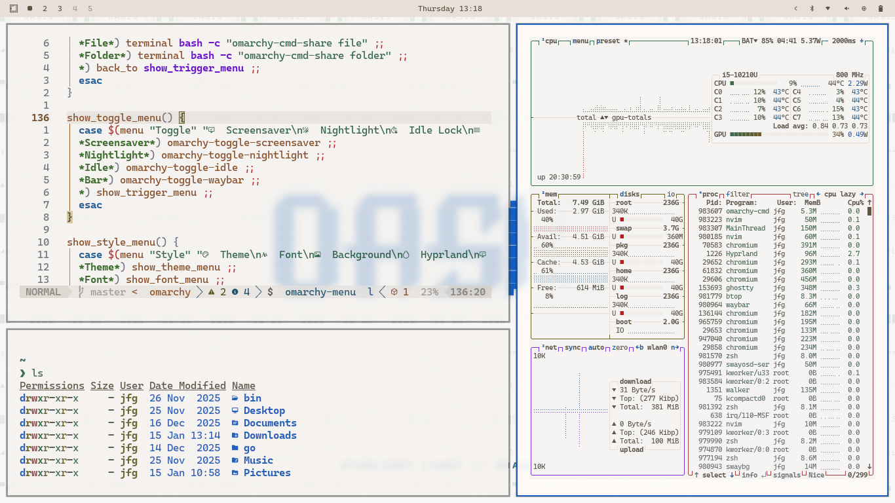
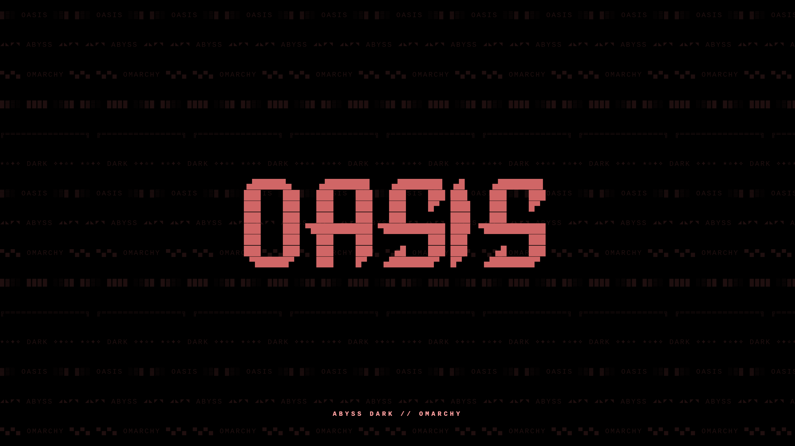
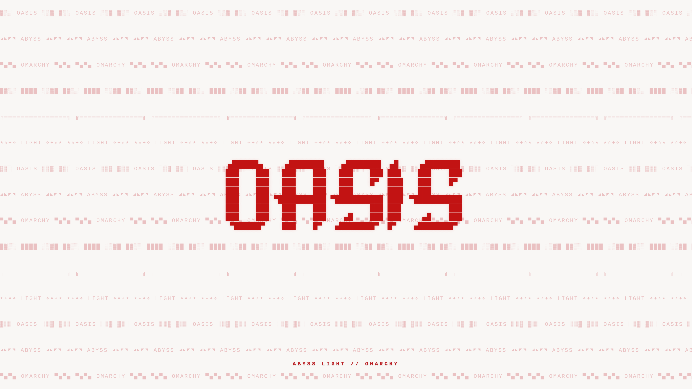
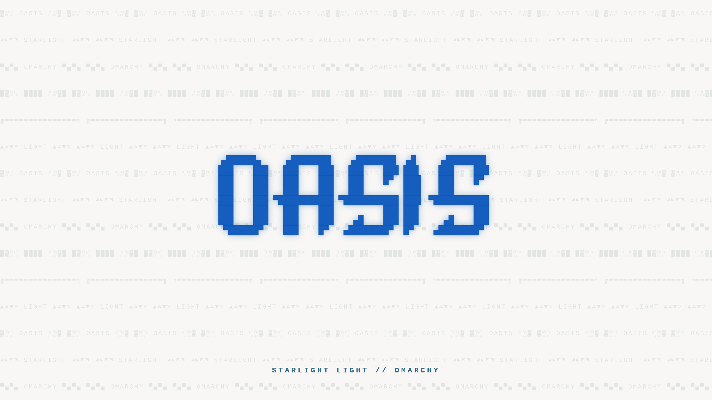

<p align="center">
  
</p>

<h1 align="center">Omarchy Oasis</h1>

<p align="center">
  <em>Desert-inspired themes for Omarchy, ported from <a href="https://github.com/uhs-robert/oasis.nvim">oasis.nvim</a></em>
</p>

---

## 🎨 Available Themes

- **abyss-dark** - Dark · Black
- **abyss-light** - Light
- **starlight-dark** - Dark · Black Vivid
- **starlight-light** - Light

_More themes coming soon as I port them from the original collection._

---

## 📦 Installation

### Quick Install (Recommended)

```bash
git clone https://github.com/joaofelipegalvao/omarchy-oasis.git
cd omarchy-oasis
chmod +x install.sh
./install.sh
```

The interactive installer lets you:

- Choose specific themes to install
- Install all themes at once
- View available themes

### Install Specific Theme

```bash
# Install only one theme
./install.sh abyss-dark
./install.sh abyss-light
./install.sh starlight-dark
```

### Manual Installation

```bash
# Clone the repository
git clone https://github.com/joaofelipegalvao/omarchy-oasis.git

# Copy desired theme
cp -r omarchy-oasis/themes/abyss-dark ~/.config/omarchy/themes/oasis-abyss-dark

# Apply the theme
omarchy-theme-set oasis-abyss-dark
```

---

## 🔄 Usage

### Switch Themes

```bash
omarchy-theme-set oasis-abyss-dark
omarchy-theme-set oasis-abyss-light
omarchy-theme-set oasis-starlight-dark
omarchy-theme-set oasis-starlight-light
```

### List Installed Themes

```bash
./scripts/list-themes.sh
```

### Uninstall Themes

```bash
./scripts/uninstall.sh              # Interactive mode
./scripts/uninstall.sh abyss-dark   # Uninstall specific theme
```

---

## 🌙 Dark Themes

Click any card below to view the full preview and screenshots. [↓ Or click here to view all full previews](#view-all-theme-styles)

<table>
  <tr>
    <td align="center">
      <a href="#abyss-dark">
        
      </a>
      <br>
      <strong>Abyss Dark</strong>
      <br>
    </td>
    <td align="center">
      <a href="#starlight-dark">
        
      </a>
      <br>
      <strong>Starlight Dark</strong>
      <br>
    </td>
  </tr>
</table>

## ☀️ Light Themes

<table>
  <tr>
    <td align="center">
      <a href="#abyss-light">
        
      </a>
      <br>
      <strong>Abyss Light</strong>
      <br>
    </td>
        <td align="center">
      <a href="#starlight-light">
        
      </a>
      <br>
      <strong>Starlight Light</strong>
      <br>
    </td>
  </tr>
</table>

---

## 👀 Full Previews

<a id="view-all-theme-styles"></a>

<details open>
  <summary><b>All themes (click to collapse)</b></summary>
  <br/>
  <a id="dark-previews"></a>
  <details open>
    <summary><b>🌕️ Dark Themes</b></summary>
    <a id="abyss-dark"></a>
    <h3>Abyss Dark (Dark · Black)</h3>
    <p><strong>Terminal Preview</strong></p>
    </img>
    <p><strong>Background Wallpaper</strong></p>
    </img>
    <p align="center">
      <a href="#dark-previews">↑ Back to Dark Themes</a>
    </p>
    <a id="starlight-dark"></a>
    <h3>Starlight Dark (Dark · Black Vivid)</h3>
    <p><strong>Terminal Preview</strong></p>
    </img>
    <p><strong>Background Wallpaper</strong></p>
    </img>
    <p align="center">
      <a href="#dark-previews">↑ Back to Dark Themes</a>
    </p>
  </details>
  <a id="light-previews"></a>
  <details open>
    <summary><b>🌞 Light Themes</b></summary>
    <a id="abyss-light"></a>
    <h3>Abyss (Light)</h3>
    <p><strong>Terminal Preview</strong></p>
    </img>
    <p><strong>Background Wallpaper</strong></p>
    </img>
    <p align="center">
      <a href="#light-previews">↑ Back to Light Themes</a>
    </p>
        <a id="starlight-light"></a>
    <h3>Starlight (Light)</h3>
    <p><strong>Terminal Preview</strong></p>
    </img>
    <p><strong>Background Wallpaper</strong></p>
    </img>
    <p align="center">
      <a href="#light-previews">↑ Back to Light Themes</a>
    </p>
  </details>
</details>

---

## 🎯 About

These themes are ports of the excellent [oasis.nvim](https://github.com/uhs-robert/oasis.nvim) colorscheme collection, adapted for the Omarchy terminal environment.

### Repository Structure

This repository uses a simple directory-based organization:

- Each theme lives in its own directory under `themes/`
- Easy to maintain and add new variations
- Clean separation between themes

---

## 🙏 Acknowledgments

- **[DHH](https://github.com/DHH)** - For creating Omarchy
- **[uhs-robert](https://github.com/uhs-robert)** - For the original [oasis.nvim](https://github.com/uhs-robert/oasis.nvim) colorschemes

---

## 📝 License

This project maintains the same license as the original oasis.nvim themes.

---

<p align="center">
  <sub>Made with ☕ for the Omarchy community</sub>
</p>
